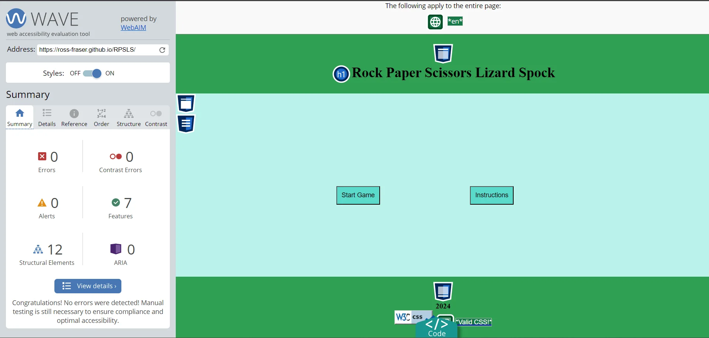
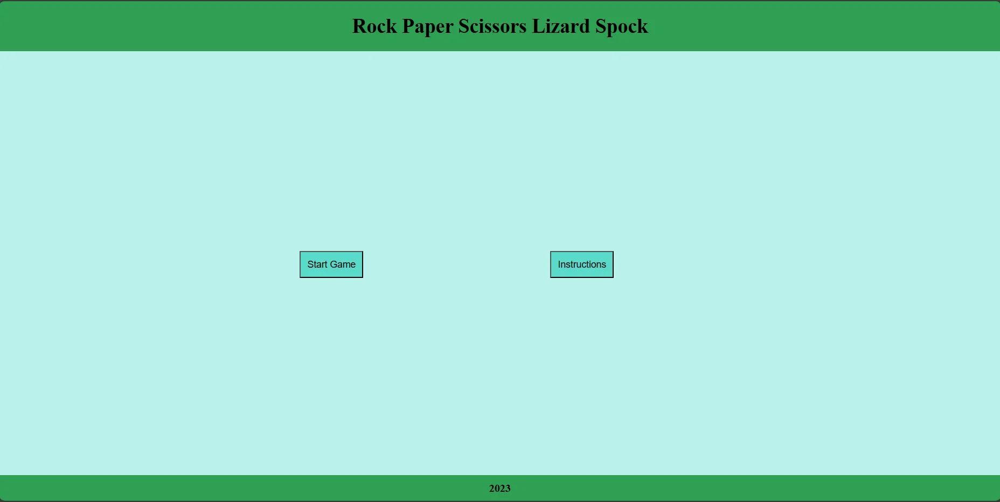
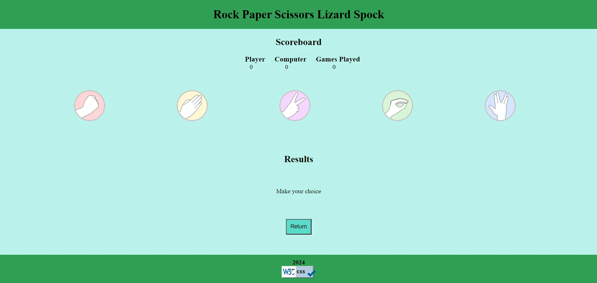
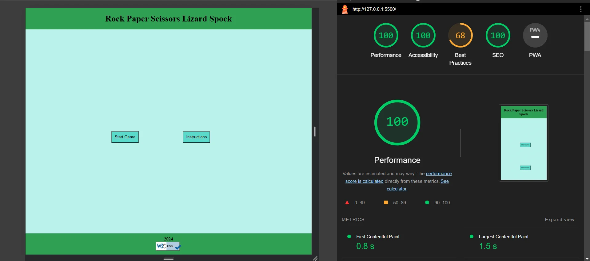

# Rock Paper Scissors Lizard Spock Game

This is a simple implementation of the Rock, Paper, Scissors, Lizard, Spock game using HTML, CSS, and JavaScript. The game allows users to play against the computer, which randomly selects one of the available choices.

## Key Objectives

### 1. Classic Gameplay

The primary goal is to implement the classic Rock, Paper, Scissors game with the addition of Lizard and Spock. Ensure that the core gameplay mechanics are correctly implemented and adhere to the standard rules:

- Rock crushes Scissors
- Scissors cuts Paper
- Paper covers Rock
- Rock crushes Lizard
- Lizard poisons Spock
- Spock smashes Scissors
- Scissors decapitates Lizard
- Lizard eats Paper
- Paper disproves Spock
- Spock vaporizes Rock

### 2. Responsive Design

Create a responsive and visually appealing user interface that works seamlessly on various devices, including desktops, tablets, and mobile phones. Prioritize a user-friendly experience with clear instructions and intuitive controls.

### 3. Dynamic Interaction

Implement JavaScript to handle the dynamic interaction between the user and the computer. Ensure that the game responds promptly to user input, updates the game state accordingly, and displays the results of each round in an engaging manner.

### 4. Stylish UI/UX

Design an aesthetically pleasing user interface with appropriate styling using CSS. Utilize animations and visual elements to enhance the gaming experience and make the interface more engaging.

### 5. Code Organization

Maintain a well-organized codebase with clear separation of concerns. Use separate HTML, CSS, and JavaScript files to enhance readability and ease of maintenance. Comment the code where necessary to provide insights into the implementation details.

### 6. Documentation

Provide comprehensive documentation to guide users and developers. This includes a detailed `README.md` file explaining how to install, play, and contribute to the project. Include screenshots to showcase the game and its features.

### 7. Testing

Conduct thorough testing to ensure the reliability and correctness of the game logic. In a `Testing.md` file over various scenarios, including user input validation and edge cases, to deliver a robust and bug-free gaming experience.

## Bugs

On clicking the instructions button the instructions and return button are not displayed, i belive it is something to do with the css file but i can't work out what it is.

## Plagiarism

I got inspiration for data-choice attribute from w3schools.com/tags/att_data-.asp

## Features

- Classic Rock, Paper, Scissors game extended with Lizard and Spock.
- Responsive design for an optimal user experience on various devices.
- JavaScript-driven logic for a dynamic and interactive gaming experience.

# Usage

### Installation

1. Clone the repository to your local machine:

   ```bash
   git clone https://github.com/Ross-Fraser/RPSLS.git
   ```

2. Open the `index.html` file in your preferred web browser.

### Playing the Game

1. Open the game in your web browser.
2. Click on the Start Game button to start the game or click on Instructions to familiarise yourself with the rules before playing.
3. Click on one of the five buttons to make your move (Rock, Paper, Scissors, Lizard, or Spock).
4. The computer will randomly select its move.
5. The winner of the round will be determined based on the game rules.
6. Enjoy playing and try to beat the computer!

## Screenshots






## Examples

Here are a few examples of how to play the game:

1. **Example 1:**

   - Player selects Rock.
   - Computer randomly selects Scissors.
   - Player wins the round!

2. **Example 2:**

   - Player selects Paper.
   - Computer randomly selects Lizard.
   - Computer wins the round.

3. **Example 3:**
   - Player selects Spock.
   - Computer randomly selects Spock.
   - It's a tie! No one wins this round.

Feel free to experiment with different moves and see how the game unfolds.
