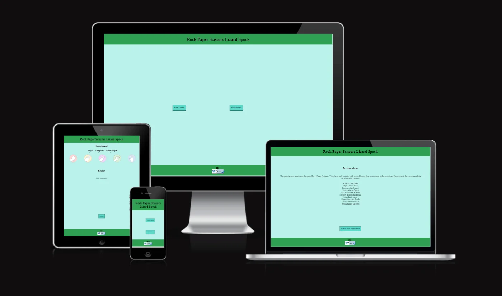
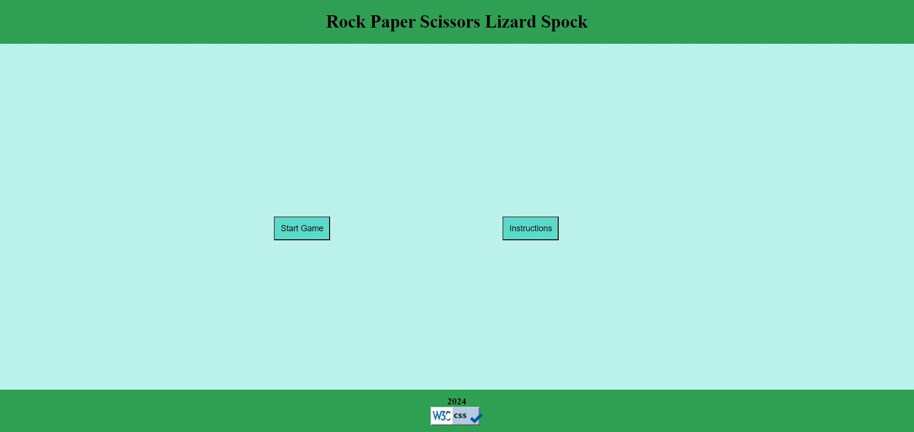
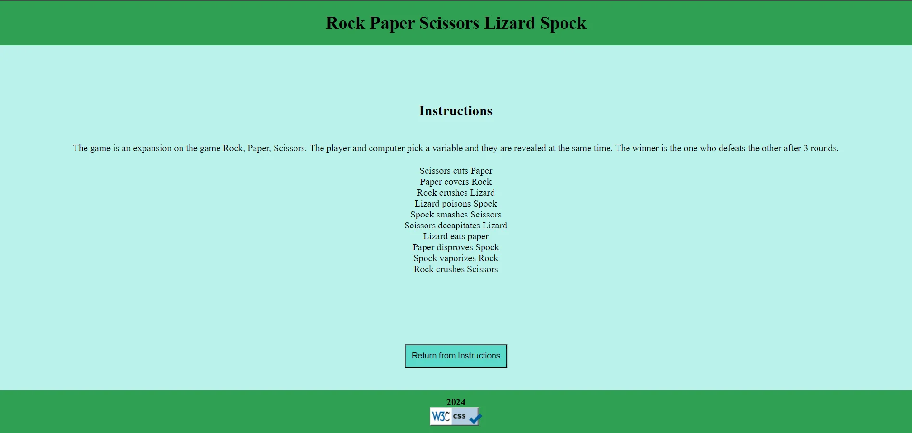
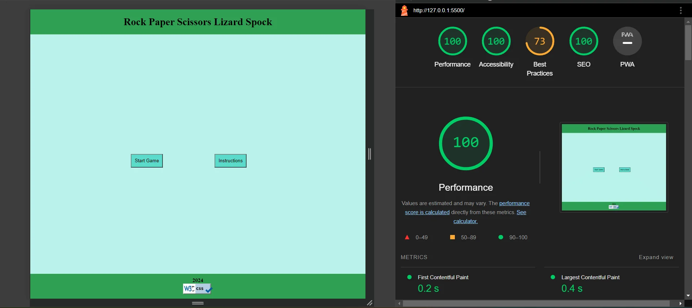

# Rock Paper Scissors Lizard Spock Game

## Key Objectives

### 1. Classic Gameplay

This is a simple implementation of the Rock, Paper, Scissors, Lizard, Spock game using HTML, CSS, and JavaScript. The game allows users to play against the computer. The purpose of such a game is primarily for entertainment and recreation. It offers a fun and interactive way for people to play the familiar Rock, Paper, Scissors game with a twist.

The inclusion of Lizard and Spock adds complexity and variety to the traditional game, making it more interesting for players. The rules are extended to include additional interactions between the new elements, creating a more strategic and diverse gameplay experience.

The value of an online Rock Paper Scissors Lizard Spock game to users lies in its entertainment and engagement factors. 

The primary goal is to implement the classic Rock, Paper, Scissors game with the addition of Lizard and Spock. Ensure that the core gameplay mechanics are correctly implemented and adhere to the standard rules:

- Rock crushes Scissors
- Scissors cuts Paper
- Paper covers Rock
- Rock crushes Lizard
- Lizard poisons Spock
- Spock smashes Scissors
- Scissors decapitates Lizard
- Lizard eats Paper
- Paper disproves Spock
- Spock vaporizes Rock

## Features

- Classic Rock, Paper, Scissors game extended with Lizard and Spock.
- Responsive design for an optimal user experience on various devices.
- JavaScript-driven logic for a dynamic and interactive gaming experience.

## Playing the Game

1. Open the game in your web browser.
2. Click on the Start Game button to start the game or click on Instructions to familiarise yourself with the rules before playing.
3. Click on one of the five buttons to make your move (Rock, Paper, Scissors, Lizard, or Spock).
4. The computer will randomly select its move.
5. The winner of the round will be determined based on the game rules.
6. Enjoy playing and try to beat the computer!

### Screenshots

### 2. Responsive Design

Create a responsive and visually appealing user interface that works seamlessly on various devices, including desktops, tablets, and mobile phones. Prioritize a user-friendly experience with clear instructions and intuitive controls.

### 3. Dynamic Interaction

Implement JavaScript to handle the dynamic interaction between the user and the computer. Ensure that the game responds promptly to user input, updates the game state accordingly, and displays the results of each round in an engaging manner.

### 4. Stylish UI/UX

Design an aesthetically pleasing user interface with appropriate styling using CSS. Utilize visual elements to enhance the gaming experience and make the interface more engaging.

### 5. Code Organization

Maintain a well-organized codebase with clear separation of concerns. Use separate HTML, CSS, and JavaScript files to enhance readability and ease of maintenance. Comment the code where necessary to provide insights into the implementation details.

## Validation Testing

- HTML
    - No errors were found when passing  through the W3C HTML validator.

- CSS
    - No errors were found when passing  through the W3C (jigsaw) css validator.

- Accessibility
    - I confirmed that the colors and fonts are easy to read and accessible by running it through lighthouse in devtools as well as wave.webaim.org.

### Additional Testing

Please see the TESTING.md file located in the main directory.

### Testing Screenshots

## Bugs

The are no bugs in the system.

## Deployment

- The site was deployed to Github pages.
    - In the Github repository, navigate to the settings tab.
    - From the source section drop-down menu, select the master branch.
    - Once the master branch has been selected, the page provided a link to the deployed site.

## Credits

Code

I got inspiration for data-choice attribute from w3schools.com/tags/att_data-.asp.
